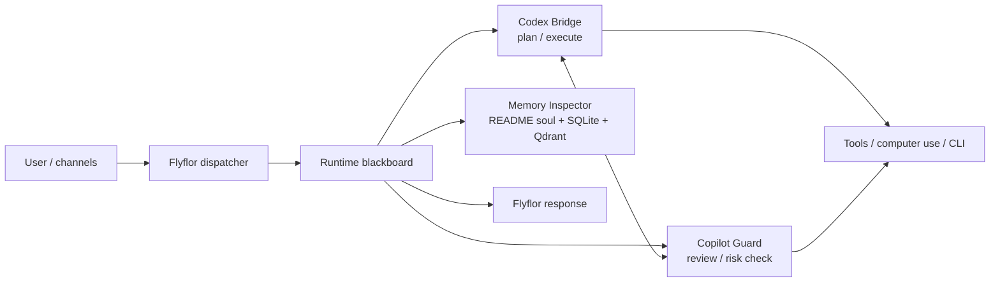

# Flyflor

Flyflor is an AI Runtime Cockpit for visible multi-agent work.

It keeps the user-facing conversation calm while exposing the runtime behind it: a blackboard, bridge dialogue, memory lookup, tool checkpoints, and final delivery. The goal is not to hide agent work behind a spinner. Flyflor makes the Codex / Copilot bridge readable while the task is happening.

## Architecture



## Runtime Model

- Flyflor receives tasks from WebUI, TUI, or configured channels.
- The blackboard records the task, bridge discussion, memory reads, tool calls, review notes, and consensus.
- Codex Bridge focuses on decomposition and execution.
- Copilot Guard focuses on review, safety, contradictions, and missed constraints.
- Memory is split deliberately: identity and soul stay in Markdown, structured state lives in SQLite, and semantic recall lives in Qdrant.

## UI Direction

Flyflor's UI is a cockpit, not a landing page.

- Web left: natural dialogue and final user-facing answer.
- Web right: grouped blackboard with readable Codex / Copilot bridge context, memory checkpoints, and review notes.
- TUI inline: each user turn shows a compact thinking summary that can expand into the current round's blackboard.

The TUI follows the same model: a compact runtime header, semantic status colors, live thinking updates, `/think` inline expansion, and `/bb` for full fx-style blackboard navigation.

## Docker

The local Docker setup is intentionally small:

```bash
docker compose build flyflor
docker compose up -d flyflor
```

Web console:

```text
http://localhost:18800
```

Gateway readiness:

```text
http://localhost:18790/ready
```

## Development Workflow

For day-to-day Web UI work, do not rebuild the Docker image after every change.

```bash
make dev-webui
```

Open:

```text
http://127.0.0.1:5173
```

Use `make build-web-dist` for frontend production output, and `make dev-build-web-backend` when the running container needs a refreshed `flyflor-web` binary. Full `docker compose up -d --build flyflor` is reserved for Dockerfile, image dependency, or release validation work.

See [Flyflor Development Workflow](docs/operations/dev-workflow.md) / [中文](docs/operations/dev-workflow.zh.md).

## Compatibility Note

This codebase still keeps some internal compatibility names such as `cmd/picoclaw`, `PICOCLAW_HOME`, and the original Go module path. Those names are runtime compatibility surfaces, not the product identity. User-facing behavior, UI, TUI, and documentation should describe Flyflor and its bridge-based intelligent-agent architecture.
