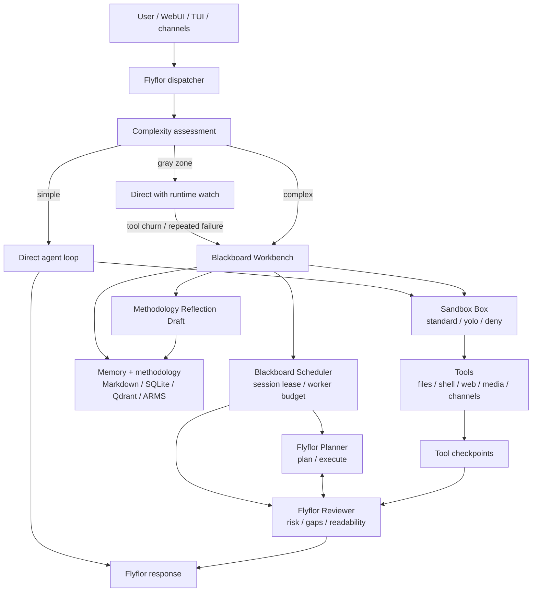
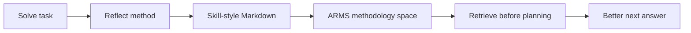

# Flyflor

Flyflor is an intelligent-agent runtime cockpit.

It is built for work that should not disappear behind a spinner: planning,
tool use, review, memory lookup, reflection, and final delivery are all first
class runtime surfaces. The user sees a calm conversation, while Flyflor keeps a
readable blackboard of how the agent is thinking, checking itself, and deciding
when it needs help.

## What Flyflor Is

Flyflor is not just a chat client. It is a visible agent runtime with:

- a direct agent path for simple questions
- a blackboard workbench for complex work
- a Sandbox Box for `/yolo`, tool risk decisions, and approval handoff
- planner and reviewer roles for decomposition and risk checks
- session isolation across WebUI, TUI, CLI, and chat channels
- Markdown identity and methodology memory
- SQLite/Qdrant-backed runtime memory paths
- tool checkpoints, runtime events, and resumable context
- self-update support through GitHub releases

The product principle is simple: **ordinary questions should feel immediate;
complex work should become inspectable.**

## Agent Architecture



### Direct Mode

Simple turns stay in the normal agent loop. Flyflor does not inject blackboard
instructions, acquire a blackboard session lease, or add worker overhead.

### Direct With Watch

Gray-zone turns start direct, but Flyflor watches for signs that the work needs
coordination. If the turn starts to churn through tools, repeats a tool failure,
hits context pressure, or enters another tool iteration, Flyflor rolls the turn
back to its restore point and reruns it in blackboard mode.

### Blackboard Mode

Complex turns use the blackboard workbench. The blackboard is not an infinite
debate room. It is a bounded coordination protocol:

- target convergence: 3 rounds
- hard upper bound: 5 rounds
- stop early on livelock
- return a decision form when human input is needed
- emit reflection drafts when a reusable method appears

See [Blackboard Workbench](docs/architecture/blackboard-workbench.md).

### Sandbox Box And YOLO

Flyflor treats sandboxing as its own runtime Box. The Sandbox Box classifies
every tool call into `read`, `low`, `medium`, `high`, or `blocked`, then returns
an action: `allow`, `confirm`, or `deny`.

TUI `/yolo` switches the turn profile from `standard` to `yolo`. That makes the
agent more autonomous for sandbox-approved file edits and focused test/build
commands, while destructive commands, credential-related actions, out-of-scope
side effects, workspace escapes, and hook denials remain protected.

See [Sandbox Box](docs/architecture/sandbox-box.md).

## Blackboard And Decision Handoff

The blackboard gives Flyflor a place to make complex work legible:

- **Planner** proposes the execution path.
- **Reviewer** challenges assumptions, risk, missing tests, and readability.
- **Scheduler** keeps the session isolated and the discussion bounded.
- **Memory** brings identity, user preference, project context, and prior lessons.
- **Tools** record checkpoints instead of vanishing into hidden logs.

If the blackboard cannot converge, Flyflor stops the internal discussion and
hands the decision back to the user. The answer includes a
`flyflor-decision-form` block that can be rendered by TUI/WebUI as single
select, multi-select, and custom input controls.

```flyflor-decision-form
{
  "version": 1,
  "title": "Decision needed",
  "summary": "Flyflor needs you to choose the path before continuing.",
  "single_select": {
    "id": "path",
    "label": "Choose one path",
    "options": [
      {
        "id": "recommended",
        "label": "Recommended",
        "description": "The safest path based on the blackboard review."
      }
    ]
  },
  "multi_select": {
    "id": "constraints",
    "label": "Optional constraints",
    "options": [
      {
        "id": "add_tests",
        "label": "Add tests",
        "description": "Require verification before final delivery."
      }
    ]
  },
  "custom_input": {
    "id": "notes",
    "label": "Additional context",
    "placeholder": "Tell Flyflor anything missing."
  }
}
```

This keeps the system from livelocking and turns uncertainty into a user-facing
choice.

## Reflection System

Flyflor treats repeated problem-solving patterns as future skills.

When a blackboard turn reveals a reusable method, Flyflor can emit a
`Methodology Reflection Draft`:

```markdown
## Methodology Reflection Draft

- Situation: When this method applies.
- Method: The repeatable approach.
- Avoid: What failed or caused delay.
- Next-time hint: A short cue for retrieval before future planning.
```

Today, this is a stable Markdown output convention. With ARMS enabled, Flyflor
indexes these drafts into an isolated methodology space. Before a future answer,
Flyflor can retrieve related methods and load them into planning without mixing
them with user facts or general semantic memory.

This is the long-term loop:



## Memory Model

Flyflor keeps memory deliberately layered:

- `workspace/SOUL.md`: agent identity, tone, and durable behavior constraints
- `workspace/USER.md`: user preferences and working style
- `workspace/memory/MEMORY.md`: long-lived project and conversation facts
- SQLite/session history: chronological runtime state
- Qdrant/semantic memory: vector recall for related context
- ARMS methodology memory: isolated reflection and self-growth methods

The design keeps human-editable memory in Markdown, general semantic recall in
Qdrant, and Flyflor's own reusable methods in ARMS. Local ARMS uses SQLite as
the source of truth, HNSW for semantic association, and an R-tree for low
dimensional methodology-space lookup. It is deliberately isolated: it stores
only `Methodology Reflection Draft` content, not user facts or ordinary
conversation memory.

## Self-Update And Iteration

Flyflor can update itself from GitHub releases:

```bash
flyflor update
```

The update command downloads the release asset for the current platform and
applies it to the running executable. The runtime also exposes version metadata:

```bash
flyflor version
```

Self-iteration is broader than binary updates:

- runtime events make agent behavior inspectable
- blackboard deadlocks become decision forms instead of silent stalls
- reflection drafts become ARMS methodology memory for future planning
- skills can be installed and forced from conversations
- WebUI/TUI both expose the same agent runtime rather than separate products

## Install

### Install With Curl

Installer:

```bash
curl -fsSL https://raw.githubusercontent.com/huaqingyi/flyflor/main/scripts/install.sh | bash
```

Options:

```bash
# Install to a custom directory
curl -fsSL https://raw.githubusercontent.com/huaqingyi/flyflor/main/scripts/install.sh | FLYFLOR_INSTALL_DIR=/usr/local/bin bash

# Install a specific release tag
curl -fsSL https://raw.githubusercontent.com/huaqingyi/flyflor/main/scripts/install.sh | FLYFLOR_VERSION=v0.1.0 bash

# Build from source when release assets are unavailable
curl -fsSL https://raw.githubusercontent.com/huaqingyi/flyflor/main/scripts/install.sh | FLYFLOR_FROM_SOURCE=1 bash
```

The installer first tries GitHub release assets. If no matching asset exists
and `git`, `make`, and `go` are available, it falls back to a source build. It
adds a `flyflor` binary and a compatibility `picoclaw` symlink when possible.

### Build From Source

```bash
git clone https://github.com/huaqingyi/flyflor.git flyflor
cd flyflor
make build
mkdir -p ~/.local/bin
cp build/picoclaw ~/.local/bin/flyflor
ln -sf ~/.local/bin/flyflor ~/.local/bin/picoclaw
```

### Docker Compose

Docker is the most complete local deployment path because it includes the Web
console and Qdrant service:

```bash
git clone https://github.com/huaqingyi/flyflor.git flyflor
cd flyflor
cp config/config.example.json config/config.json
docker compose up -d flyflor
```

Open:

```text
http://localhost:18800
```

Gateway readiness:

```text
http://localhost:18790/ready
```

More detail: [Docker Guide](docs/guides/docker.md).

## Use

Run the TUI:

```bash
flyflor agent
```

Ask a one-shot question:

```bash
flyflor agent -m "Explain the blackboard workbench in one paragraph."
```

Start the Web console with Docker:

```bash
docker compose up -d flyflor
```

Useful commands:

```bash
flyflor onboard
flyflor version
flyflor update
flyflor auth status
flyflor mcp list
flyflor cron list
```

## Development

For day-to-day Web UI work, do not rebuild the Docker image after every change:

```bash
make dev-webui
```

Open:

```text
http://127.0.0.1:5173
```

Build pieces:

```bash
make build
make build-web-dist
make dev-build-web-backend
make dev-build-cli
```

Full Docker rebuild is reserved for Dockerfile, image dependency, or release
validation work:

```bash
docker compose up -d --build flyflor
```

See [Flyflor Development Workflow](docs/operations/dev-workflow.md).

## Documentation

- [Blackboard Workbench](docs/architecture/blackboard-workbench.md)
- [ARMS Methodology Memory](docs/architecture/arms-methodology-memory.md)
- [Routing Guide](docs/guides/routing-guide.md)
- [Runtime Events](docs/architecture/runtime-events.md)
- [Session System](docs/architecture/session-system.md)
- [Configuration Guide](docs/guides/configuration.md)
- [Docker Guide](docs/guides/docker.md)
- [Chat Apps](docs/guides/chat-apps.md)

## Compatibility Note

The codebase still keeps some internal compatibility names such as
`cmd/flyflor`, `PICOCLAW_HOME`, binary names like `picoclaw`, and the original
Go module path. These are compatibility surfaces. User-facing documentation and
behavior should describe Flyflor and its blackboard-based intelligent-agent
architecture.
