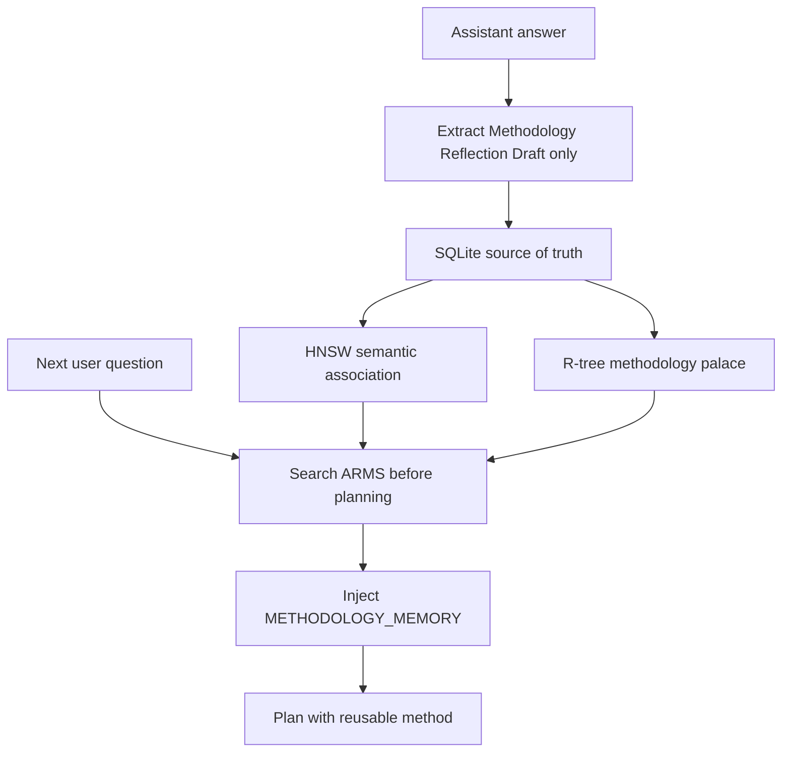

# ARMS Methodology Memory

ARMS is Flyflor's isolated methodology memory layer.

It is not a general semantic memory database. It must not store user facts,
project facts, chat summaries, preferences, tool logs, or ordinary assistant
answers. ARMS stores only reusable methods produced by Flyflor's reflection
loop.

## Boundary

ARMS owns:

- `Methodology Reflection Draft` sections emitted by blackboard turns
- reusable process methods
- self-growth notes
- next-time hints for future planning

ARMS does not own:

- `workspace/USER.md`
- `workspace/SOUL.md`
- `workspace/memory/MEMORY.md`
- session history
- Qdrant semantic memory
- user preferences
- project facts
- generic assistant outcomes

This isolation is intentional. Qdrant can answer "what related facts have we
seen?" ARMS answers "what method has Flyflor learned for this kind of problem?"

## Flow



## Indexing

Indexing happens during `ContextManager.Ingest`.

The extractor is intentionally strict:

- only assistant messages are considered
- only `## Methodology Reflection Draft` sections are considered
- the draft must contain a reusable `Situation` or `Method`
- plain delivery summaries are ignored
- user text is ignored even if it contains the same heading

The indexed document uses `source = flyflor.reflection`,
`namespace = methodology`, and a stable content-derived ID.

## Retrieval

Retrieval happens during `ContextManager.Assemble`, before building the model
prompt. If ARMS returns hits, Flyflor appends a separate prompt block:

```text
METHODOLOGY_MEMORY: Retrieved from ARMS. These are Flyflor self-growth methods only, not user facts, project facts, or general conversation memory.
```

The block is guidance for planning and reviewing. It is lower priority than the
current user instruction.

## Local Store

The default ARMS driver is local:

- SQLite stores the methodology documents, metadata, hash embeddings, and
  method-space coordinates.
- HNSW is rebuilt from SQLite at startup and handles semantic association.
- R-tree is rebuilt from SQLite at startup and handles low-dimensional
  methodology-space positioning.

The R-tree does not index the high-dimensional semantic vector. It indexes a
small convention-based "methodology palace" coordinate derived from the draft:
code, docs, architecture, deployment, verification, blackboard collaboration,
risk, and reflection/memory. This keeps the spatial index meaningful and avoids
using R-tree as a high-dimensional vector database.

## Configuration

ARMS lives under `agents.defaults.context_manager_config.arms`:

```json
{
  "arms": {
    "enabled": true,
    "driver": "local",
    "path": "~/.picoclaw/arms/arms.db",
    "space_id": "flyflor-methodologies",
    "dimensions": 256,
    "top_k": 5
  }
}
```

The HTTP driver remains available for a future remote ARMS service:

```json
{
  "arms": {
    "enabled": true,
    "driver": "http",
    "api_base": "http://arms:18770",
    "space_id": "flyflor-methodologies"
  }
}
```

Environment variables are also supported:

- `FLYFLOR_ARMS_ENABLED`
- `FLYFLOR_ARMS_DRIVER`
- `FLYFLOR_ARMS_PATH`
- `FLYFLOR_ARMS_API_BASE`
- `FLYFLOR_ARMS_API_KEY`
- `FLYFLOR_ARMS_SPACE_ID`
- `FLYFLOR_ARMS_DIMENSIONS`
- `FLYFLOR_ARMS_TOP_K`

## HTTP Contract

The optional HTTP adapter uses a small contract:

- `POST /v1/spaces/{space_id}/methodologies/upsert`
- `POST /v1/spaces/{space_id}/methodologies/search`
- `GET /v1/spaces/{space_id}/status`

Every request includes `namespace = methodology` and
`isolation_kind = methodology_only` so the ARMS service can reject accidental
general-memory writes.
