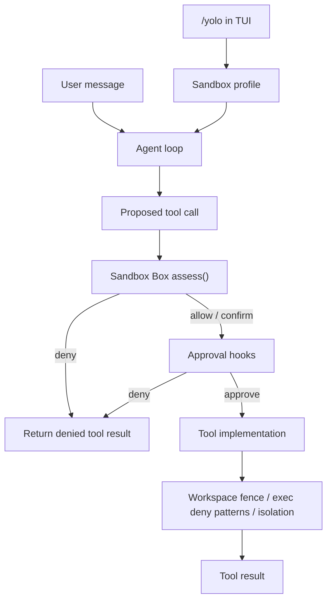

# Sandbox Box

The Sandbox Box is Flyflor's first-class execution policy layer. It answers one
question before any tool call runs:

> Is this action safe to run now, should it ask for approval, or must it be
> blocked?

It is separate from model routing and separate from the blackboard. The
blackboard decides whether work needs collaboration. The Sandbox Box decides how
much autonomy a concrete action receives.

## Principles

- **Convention over configuration**: workspace restriction, command deny
  patterns, and sandbox risk classes are on by default.
- **YOLO is autonomy inside the sandbox**: `/yolo` allows low and medium risk
  work to proceed more actively. It does not bypass destructive-command guards,
  credential boundaries, hook denials, or workspace fences.
- **Defense in depth**: the Sandbox Box classifies the call, existing tools still
  validate paths and command safety, and approval hooks can still deny.
- **Human approval is a protocol, not a prompt hack**: decisions include an
  `action` field (`allow`, `confirm`, `deny`) so TUI/WebUI can later render a
  confirmation form without changing the tool pipeline.

## Runtime Shape

## Profiles

| Profile | Source | Behavior |
| --- | --- | --- |
| `standard` | Default for CLI, channels, WebUI, and TUI | Allows read-only and low-risk actions. Medium/high risk actions are marked `confirm` for approval hooks and future UI forms. |
| `yolo` | TUI `/yolo on` | Allows low and medium risk actions when they stay inside sandbox policy. High risk actions still require confirmation. Blocked actions are denied. |

## Risk Classes

| Risk | Examples | Default Action |
| --- | --- | --- |
| `read` | `read_file`, `list_dir`, `load_image` | `allow` |
| `low` | search, tool discovery, focused read/test/build shell commands | `allow` |
| `medium` | file edits, appends, writes, general shell commands, external delivery | `confirm` in standard, `allow` in yolo |
| `high` | unknown high-impact paths or broad side effects | `confirm` |
| `blocked` | destructive command patterns such as `rm -rf`, `sudo`, `curl ... \| bash`, `git push`, disk formatting | `deny` |

## Integration Points

- `pkg/sandbox`: owns `Box`, `Call`, `Decision`, profiles, risk classes, and
  default classification rules.
- `pkg/agent/processOptions`: carries the per-turn sandbox profile.
- `pkg/agent/pipeline_execute.go`: calls `SandboxBox.Assess` before approval
  hooks and concrete tool execution.
- `ToolApprovalRequest.Sandbox`: exposes the decision to hook processes.
- Runtime event `agent.sandbox.assessed`: records profile, tool, risk, action,
  and reasons.
- TUI `/yolo`: switches the next turns to profile `yolo` and injects sandbox
  profile instructions through the prompt overlay system.

## Relationship To Existing Isolation

Sandbox Box is the policy brain. It does not replace the existing lower-level
guards:

- `restrict_to_workspace` still confines filesystem tools.
- `tools.exec.enable_deny_patterns` still blocks dangerous shell patterns.
- `isolation.enabled` still controls subprocess isolation for commands started
  by Flyflor.
- Approval hooks still have final veto power.

This means `/yolo` can be useful without becoming unsafe: it reduces unnecessary
confirmation for ordinary development work, while destructive or out-of-scope
actions remain blocked or approval-gated.
